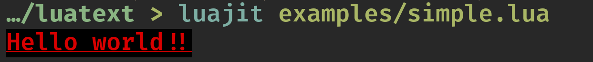
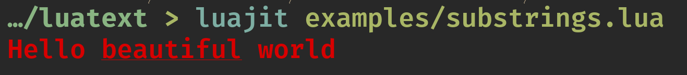

# LuaText

A small zero dependency library to print colored text to the console.

---

<!--toc:start-->
- [LuaText](#luatext)
  - [Example](#example)
  - [Reference](#reference)
  - [Installation](#installation)
  - [Color Codes](#color-codes)
  - [Development](#development)
    - [Testing](#testing)
<!--toc:end-->

---

> LuaText should be compatible with LuaJIT 2.1, Lua 5.1, 5.2, 5.3, and 5.4.

## Example

A simple example to render an entire string in red on a black background, underlined:

```lua
local text = require("luatext")

local my_str = text
    :new("Hello world!!")
    :fg(160)  -- red as an ANSI256 color code
    :bg({0, 0, 0}) -- black as an RGB value
    :underlined()

print(my_str)
```

Running this code will produce the following output:



You can also add substrings to your text. The substrings will inherit the formatting of the parent
text. Thus you can for instance run:

```lua
local text = require("luatext")

local my_str = text
    :new()
    :fg(text.COLOR.RED)
    :append(
      "Hello ",
      text:new("beautiful"):underlined(),
      " world"
    )

print(my_str)
```

Which will produce a fully red string, with only the substring `beautiful` underlined:



## Reference

For a full reference of the API, see [the reference](/docs/reference.md).

## Installation

## ANSI256 Color Codes

To get a list of ANSI color codes run:

```bash
curl -s https://gist.githubusercontent.com/HaleTom/89ffe32783f89f403bba96bd7bcd1263/raw/e50a28ec54188d2413518788de6c6367ffcea4f7/print256colours.sh | bash
```

## Development

### Testing

Testing is done via `busted`. To run all tests, run:

```bash
busted .
```


<!-- https://luarocks.org/enet-1.0-0.rockspec -->
<!-- https://github.com/luarocks/luarocks/wiki/Rockspec-format -->
