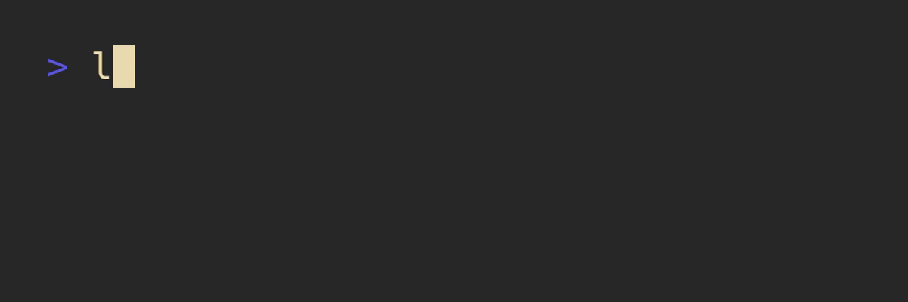

# 

A small library to print colored text to the console.

---

<!--toc:start-->
- [Example](#example)
- [Reference](#reference)
- [Installation](#installation)
- [ANSI256 Color Codes](#ansi256-color-codes)
- [Development](#development)
  - [Testing](#testing)
<!--toc:end-->

---

> LuaText should be compatible with LuaJIT 2.1, Lua 5.1, 5.2, 5.3, and 5.4.

## Example

A simple example to render an entire string in red on a black background, underlined:

```lua
local text = require("luatext")

local my_str = text
    .Text
    :new("Hello world!!")
    :fg(160)  -- red as an ANSI256 color code
    :bg({0, 0, 0}) -- black as an RGB value
    :underlined()

print(my_str)
```

Running this code will produce the following output:



You can also add substrings to your text. The substrings will inherit the formatting of the parent
text. Thus you can for instance run:

```lua
local text = require("luatext")

local my_str = text
    .Text
    :new()
    :fg(text.Color.Red)
    :append(
      "Hello ",
      text.Text:new("beautiful"):underlined(),
      " world"
    )

print(my_str)
```

Which will produce a fully red string, with only the substring `beautiful` underlined:


A LuaText object can also be used as a standard string:

```lua
local text = require("luatext")

print("Hello "..text.Text:new("fading"):blink().." world...")
```

Which will print `Hello fading world...` with the word `fading` blinking.

## Reference

For a full reference of the API, see [the reference](/docs/reference.md).

## Installation

This module is hosted on LuaRocks and can thus be installed via:

```bash
luarocks install luatext
```

Otherwise, since the module is fully self contained, one can also simply copy the `luatext.lua` into
their project.

## ANSI256 Color Codes

To get a list of ANSI color codes run:

```bash
curl -s https://gist.githubusercontent.com/HaleTom/89ffe32783f89f403bba96bd7bcd1263/raw/e50a28ec54188d2413518788de6c6367ffcea4f7/print256colours.sh | bash
```

## Development

### Testing

Testing is done via `busted`. To run all tests, run:

```bash
busted .
```
